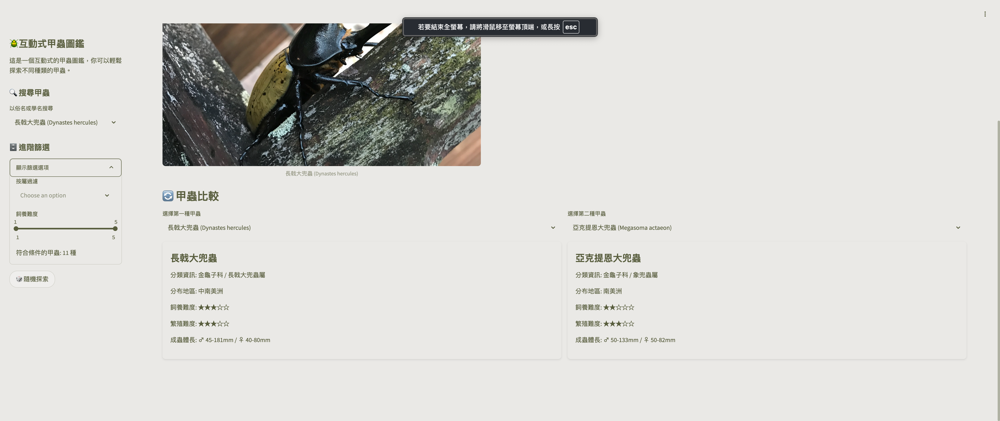
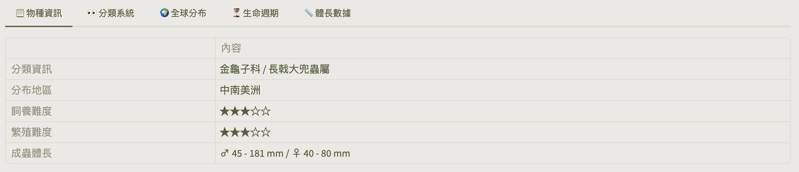
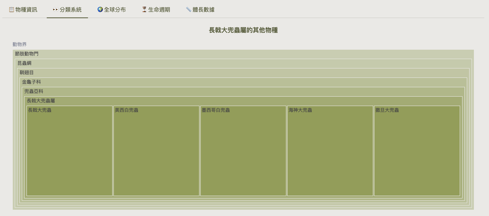
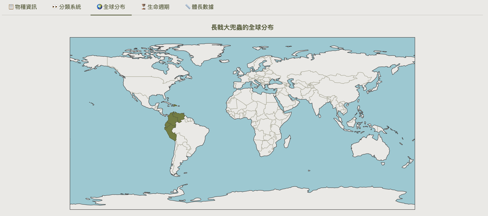
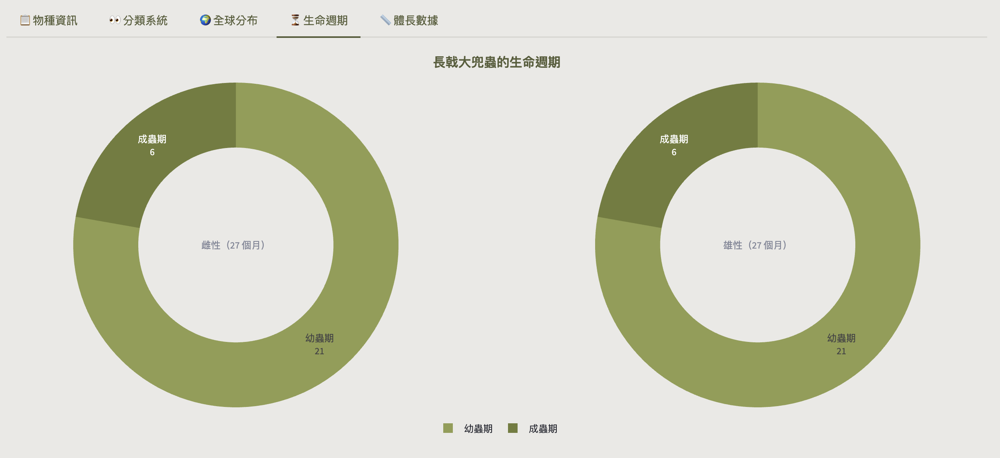
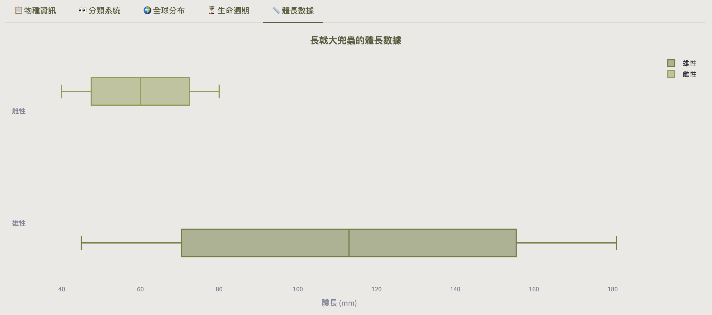

# 🪲 互動式甲蟲圖鑑

## 📌 專案簡介

這是一個以 Streamlit 開發的互動式甲蟲圖鑑原型系統，透過資料視覺化與分類資訊的整合，提升探索體驗並推廣生態教育。

- 互動圖表：以視覺化方式直觀呈現甲蟲資訊，強化使用者瀏覽與比較體驗。
- 教育導向：結合圖像與分類脈絡，協助系統性理解物種特徵。
- 彈性擴展：支援加入其他昆蟲類群，未來可整合 AI 搜尋與影像辨識功能。

---

## 🚀 使用說明

1. 建立環境
```bash
conda create -n beetle_atlas python=3.12 -y
conda activate beetle_atlas
```

2. 安裝套件
```bash
pip install -r requirements.txt
```

3. 啟動程式
```bash
streamlit run app.py
```

---

## 👀 畫面截圖









